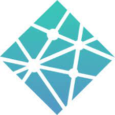
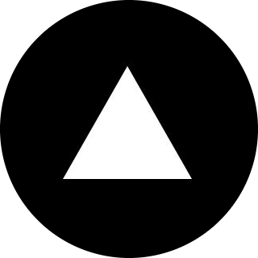

## Hi there </a> I'm Oyinkansola Shoroye - Teqbaddie ⚡

 

  

### Here's a quick summary about me:

- 😊 Pronouns: She/her
- 💡 Fun fact: I'm currently studying at AltSchool Africa [School of Software Engineering](https://altschoolafrica.com/schools/engineering) Class of 2022.
- 🌱 I’m currently learning VueJS, PHP, and Python.
- 😊 I’m open to open source projects, hackathons and internships.
- 💼 Job interests: Software Engineer, Frontend Engineer, or UI Engineer.
- 📫 You can contact me by emailing oyinkansolashoroye@gmail.com.

### Connect with me:

&nbsp;&nbsp;

&nbsp;&nbsp;

&nbsp;&nbsp;

### Languages & Tools:

 
 

 
 
 
 
 
 
 
 
 

 

      
 

[twitter]: https://twitter.com/teq_baddie
[instagram]: https://instagram.com/oyinkansola_shoroye
[linkedin]: https://linkedin.com/in/teqbaddie
[globe]: https://oyinkansolashoroye.netlify.app

 

 

 

 
    
    

 

